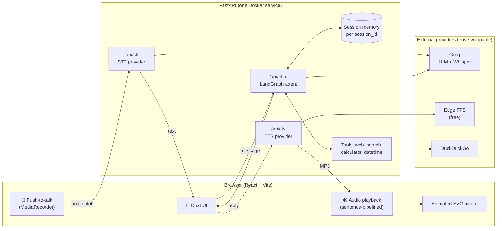

# Reusable Voice Agent + Chatbot

**Live Demo:** [https://aria-voice-agent-h8l6.onrender.com](https://aria-voice-agent-h8l6.onrender.com)

A drop-in voice agent + chatbot core for hackathon projects. Four decoupled
layers — STT, LangGraph agent, TTS, React UI — each swappable via environment
variables, so you can re-theme it (medical, legal, finance, civic) by changing
**one plugin file and one env var**, without touching the plumbing.

```
Mic audio → STT → text → LangGraph agent (tools + memory) → reply → TTS → audio
                              ↑
                    text chat UI uses the same agent
```

## Tech Stack

| Layer | Technology | Why |
|---|---|---|
| **Frontend** | React 18 + Vite | Fast dev server, tiny production build |
| **UI / Avatar** | Hand-drawn SVG + CSS animations | Animated anime assistant (blink, lip-sync, head tilt) with zero image assets |
| **Mic capture** | Web Audio API (`MediaRecorder`) | Push-to-talk recording in the browser, no plugins |
| **Backend API** | FastAPI (Python) + Uvicorn | Async endpoints, serves the built frontend too |
| **Agent framework** | LangChain 1.x + LangGraph | Tool-calling agent with per-session memory (`InMemorySaver`) |
| **LLM** | `openai/gpt-oss-120b` via Groq | Free tier, very fast inference, reliable tool calling |
| **STT** (speech→text) | Whisper `large-v3-turbo` via Groq | Same free API key as the LLM, auto language detection |
| **TTS** (text→speech) | Microsoft Edge TTS | Free, no key, natural voices incl. Hindi & Indian English |
| **Agent tools** | DuckDuckGo search (`ddgs`), calculator, clock | Live info without any paid search API |
| **Deployment** | Docker (multi-stage) on Render | One service = API + UI, HTTPS so the mic works |

## Architecture



**Design principle:** every layer is behind an interface chosen by an env
var, so any piece (LLM, STT, TTS, domain tools) swaps without touching the
rest. The agent core (`backend/voice_core/`) has no dependency on FastAPI
or the UI — it can be dropped into any Python project.

### Project structure

```
├── backend/
│   ├── app.py                  # FastAPI: /api/chat, /api/stt, /api/tts (+ serves UI)
│   └── voice_core/             # portable core — no web-framework dependency
│       ├── agent.py            # LangGraph agent + memory + retry
│       ├── stt.py              # STT providers (Groq Whisper, Deepgram)
│       ├── tts.py              # TTS providers (Edge, ElevenLabs)
│       ├── config.py           # all env-driven settings
│       └── plugins/demo.py     # persona + tools (copy per hackathon theme)
├── frontend/
│   └── src/
│       ├── App.jsx             # chat, push-to-talk, status, playback pipeline
│       ├── AnimeGirl.jsx       # the animated SVG assistant
│       ├── api.js              # only file that talks to the backend
│       └── useRecorder.js      # MediaRecorder hook
├── Dockerfile                  # multi-stage: build UI → run API serving both
└── render.yaml                 # Render blueprint (one-click deploy)
```

## Quick start

**1. Configure** — copy `.env.example` to `.env` and set at minimum
`GROQ_API_KEY` (free at console.groq.com; used for both the LLM and Whisper
STT). TTS defaults to Edge TTS, which is free and needs no key.

**2. Backend** (Python 3.10+):
```bash
cd backend
python -m venv .venv
.venv\Scripts\activate          # Windows
pip install -r requirements.txt
uvicorn app:app --reload --port 8000
```

**3. Frontend** (Node 18+):
```bash
cd frontend
npm install
npm run dev
```

Open http://localhost:5173 — tap the mic to talk (tap again to send), or type
in the text box. Text chat keeps working even if the mic or an audio provider
fails, so a demo never dies.

## Re-theming for a new hackathon (the whole point)

1. Copy `backend/voice_core/plugins/demo.py` to e.g. `medical.py`.
2. Edit `SYSTEM_PROMPT` (the persona) and `get_tools()` (return LangChain
   `@tool` functions: a RAG retriever, an API call, a calculator — anything).
3. Set `AGENT_PLUGIN=medical` in `.env`. Done — STT, TTS, memory, and UI are
   untouched.

You can also override just the persona without code via `SYSTEM_PROMPT=` in
`.env`.

## Swapping providers

Everything is chosen in `.env`:

| Layer | Env var       | Options                                             |
|-------|---------------|-----------------------------------------------------|
| LLM   | `LLM_MODEL`   | any `provider:model` string LangChain supports, e.g. `groq:llama-3.3-70b-versatile`, `anthropic:claude-sonnet-5`, `openai:gpt-4o-mini` |
| STT   | `STT_PROVIDER`| `groq` (Whisper) or `deepgram`                      |
| TTS   | `TTS_PROVIDER`| `edge` (free, no key) or `elevenlabs`               |

To add a provider, subclass `STTProvider`/`TTSProvider` in
`backend/voice_core/stt.py` / `tts.py` and add it to the `PROVIDERS` dict.
For Hindi or other languages, Edge TTS voices like `hi-IN-SwaraNeural` work
out of the box (`EDGE_TTS_VOICE` in `.env`); Groq Whisper auto-detects the
spoken language.

## Embedding in another project

The core is the `backend/voice_core` package — it has no dependency on
FastAPI or the UI:

```python
from voice_core.agent import chat          # async: chat(message, session_id)
from voice_core.stt import get_stt         # await get_stt().transcribe(bytes)
from voice_core.tts import get_tts         # await get_tts().synthesize(text)
```

Copy the folder (plus `requirements.txt` deps) into any Python project, or
keep the whole backend and point any frontend at its three endpoints:
`POST /api/stt`, `POST /api/chat`, `POST /api/tts` (see `backend/app.py`).
The React app in `frontend/src` is similarly portable — `api.js` is the only
file that talks to the backend.

## Deploying to Render (free)

The whole app ships as **one Docker service** — FastAPI serves both the API
and the built React UI, so there's one URL and no CORS setup. The
[`Dockerfile`](Dockerfile) and [`render.yaml`](render.yaml) are already here.

1. **Put the project on GitHub** (Render deploys from a git repo):
   ```bash
   cd "D:\ai voice"
   git init && git add . && git commit -m "Voice agent"
   git branch -M main
   git remote add origin https://github.com/<you>/<repo>.git
   git push -u origin main
   ```
   `.env` is git-ignored, so your key is never pushed.

2. **Create the service on Render:**
   - Go to [dashboard.render.com](https://dashboard.render.com) → **New → Blueprint**
   - Connect your GitHub repo. Render reads `render.yaml` automatically.
   - When prompted, set the one secret: **`GROQ_API_KEY`** = your Groq key.
   - Click **Apply**. First build takes ~3–5 min.

3. Open the `https://<name>.onrender.com` URL. Because Render serves over
   **HTTPS**, the microphone works (browsers block mic on plain http).

**Free-tier note:** the service sleeps after ~15 min idle and takes ~50s to
wake. Before a live demo, open the URL once to warm it up, or ping
`/api/health` every few minutes (e.g. a free [cron-job.org](https://cron-job.org)
job) to keep it awake.

To change the voice/model/plugin in production, edit the env vars in the
Render dashboard (or `render.yaml`) — no code change needed.

## API

| Endpoint        | In                          | Out                |
|-----------------|-----------------------------|--------------------|
| `GET /api/health` | —                         | active config      |
| `GET /api/session`| —                         | fresh `session_id` |
| `POST /api/chat`  | `{message, session_id}`   | `{reply}`          |
| `POST /api/stt`   | multipart `audio` file    | `{text}`           |
| `POST /api/tts`   | `{text}`                  | MP3 bytes          |

Memory is per `session_id`, in-process (LangGraph `InMemorySaver`). For
cross-restart persistence, swap in a SQLite/Postgres checkpointer in
`voice_core/agent.py` — one line.

## Demo-day notes (from the spec)

- Push-to-talk is deliberate: more reliable on stage than always-on listening.
- Keep a fallback provider tested in advance (e.g. `TTS_PROVIDER=edge` needs
  no key; the UI also falls back to the browser's built-in voice if TTS fails).
- Rehearse with a scripted question in case venue noise hurts STT.
